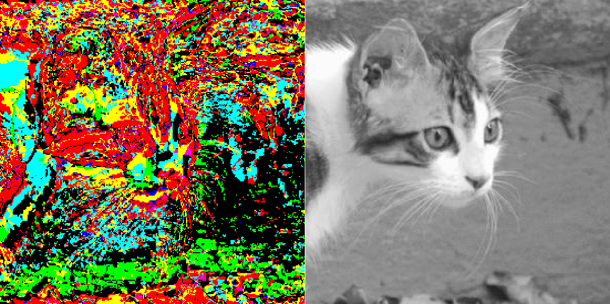

# Information Fragmentation and Syntax Analysis

<br>
<p align="center">
  
</p>

* This repository provides an R package called **PatchProcess** to perform **Fragmentation** and **Syntax analysis** on digital (jpg) images.

## Installation
 
* To (re)compile, run in directory package <br/>

```bash
R CMD build PatchProcess 
R CMD INSTALL PatchProcess
```

* To launch the application, just run the R script in your console <br/>

```bash
./PatchProcess/tests/test.R
```


* The package along with the files architecture were created using the following command <br/>
```bash
Rcpp.package.skeleton("PatchProcess", code_files = "PatchProcess.R")
```

## License

[](https://www.gnu.org/licenses/lgpl-2.1.html)


===============

<sup>*Olivier Catoni and Gautier Appert*


